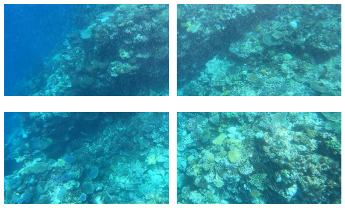
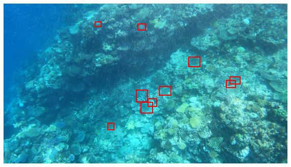

# ⭐🐟 Kaggle competition : TensorFlow - Help Protect the Great Barrier Reef ⭐🐟
# 🏁 267/2026 (top 14%)
## Detect crown-of-thorns starfish in underwater image data
### By Luca Ordronneau

### 📌 Data Preparation
I re-labelled the dataset with **RoboFlow**, as many annotations were missing. Moreover, I split my dataset in two parts (training and validation) thanks to a **GroupKFold** (`k=5`) on the video sequences, in order to avoid **overfitting** ie to avoid images of the same sequence to be in the training set and the validation set.

### 📌 Preprocessing 
For the preprocessing of the images I used a technique consisting in cutting the image into several **tiles**. I made this choice because the objects (starfish) represent on average `less than 1%` of the image. So instead of having `1280x720` images I had `640x320` images. This allowed a **faster training** and **more visible objects**.

Here is an interesting research paper on the subject: [The Power of Tiling for Small Object Detection](https://openaccess.thecvf.com/content_CVPRW_2019/papers/UAVision/Unel_The_Power_of_Tiling_for_Small_Object_Detection_CVPRW_2019_paper.pdf)

### 📌 Training
I decided to finetune a `yolov5s` model by changing some hyperparameters of augmentations. Furthermore, my **training images were image tiles** (640x360) and my **validation images were classic images** (1280x720). The model choice metric was the `F2 score` (modified in the yolov5 files)

### 📌 Prediction
I proceeded in two steps:
- First I made predictions in a classical way by adjusting the hyperparameters as well as possible (confidence, iou, tta, image resolution)
- Then I took my best model and added tracking with the library ([norfair](https://github.com/tryolabs/norfair)) which improved my results. Finally, I performed a model ensemble ([WBF : Weighted-Boxes-Fusion](https://github.com/ZFTurbo/Weighted-Boxes-Fusion)), i.e. I merged the predictions of two models:
  - A model trained with the image tiles
  - A model trained with the classic images
  
The results were even better

